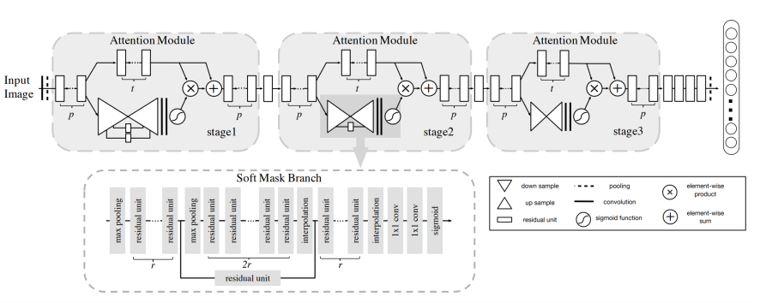
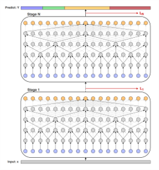

# ENGN8602
Deep learning methods have yielded many results in the field of facial expression recognition recently, however, many studies only focused on the recognition of still images, rather than changes in facial expression over a continuous time. We evaluated a structure that can be implemented easily to classify people’s emotional status in a video. We compared various deep learning models in video classification fields, and we implemented a network with residual attention module to extract video features and visualized its effectiveness. We demonstrated that this feature extractor module significantly improves model’s overall performance. This work highlights the benefits of attention mechanisms in analyzing human’s facial expressions across a period of time. We also tried its performance subject-wisely and classification ability of more refined labels.

## Requirement
See [requirements.txt](./requirements.txt) for further details.

## Dataset
[SENDv1](https://github.com/StanfordSocialNeuroscienceLab/SEND) dataset is a set of rich, multimodal videos of self-paced, unscripted emotional narratives, annotated for emotional valence over time. The complex narratives and naturalistic expressions in this dataset provide a challenging test for contemporary time-series emotion recognition models. 

In this project, however, we utilized only the visual features to recognize emotional status.

## Model
The model can be decoupled into two parts, the feature extraction model and the classification model. The feature extraction model we adapted in this project is a ResNet with Attention module network, and the classification model is MS-TCN. Feel free to try other combinations if you wish. 

  
   
  Extractor model architechture

  
   
  Classification model architechture

### Training
1. Due to ethical issues, I couldn't public the extracted features as well as the dataset. Please use your own features or request to use SENDv1 through [here](https://docs.google.com/forms/d/e/1FAIpQLSeDOEVB5p_W-MagZbIKQoB3pFCb0JW-NX7Br068M8m1ILJ3Lg/viewform). In default, you can used my extracted features in `data/i3d_feature`. The features were extracted by I3D model that pre-trained on Kinetice dataset.  
  Run with `python train_with_features_tcn.py`（for TCN model） or `python train_with_features_ms_tcn.py` (for MS-TCN model) 
  Then, the trained model parameters will be saved in `model_zoo/your_model_zoo`
2. Using your own features 
   Put your features file under `data/other_features`. And change the command based on the instructions below:
   
   OR: 
   

## Reference
For the MS-TCN: https://github.com/yabufarha/ms-tcn

For the residual channel attention network: https://github.com/yulunzhang/RCAN
